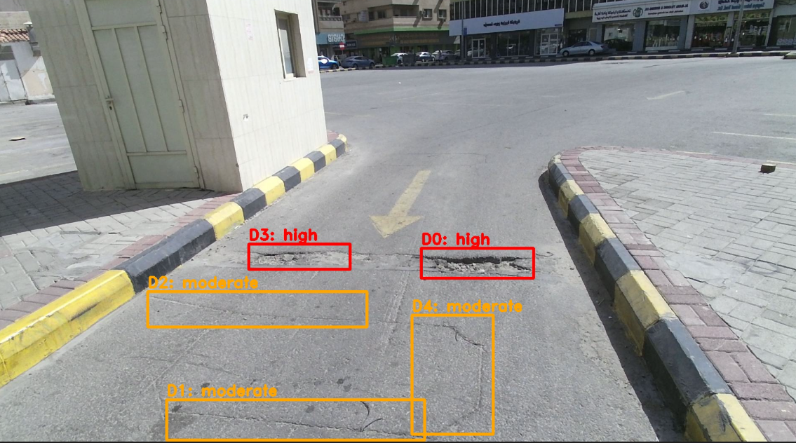
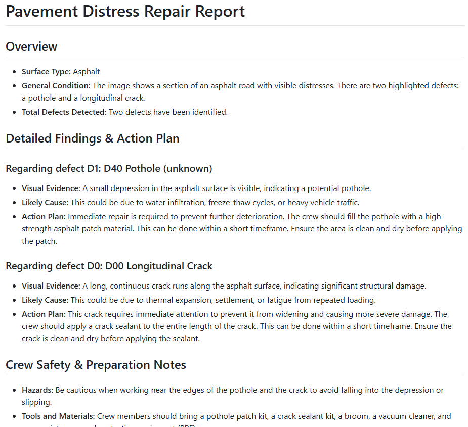

# SkyLink: Road Inspection VLM

This repository contains the software suite for autonomous drone road inspection using the Qwen2.5-VL-7B-Instruct Vision Language Model.

## The SkyLink Story: From Cloud to Edge

Building a fully autonomous drone road inspection system is hard. Building one that actually works when deployed in the real world—where internet is spotty, edge devices have limited power, and security is paramount—is a completely different beast. Here is how we tackled the biggest challenges in taking SkyLink from a proof-of-concept to a field-ready application.

### The Heavyweight Problem: Splitting the Monolith
**The Problem:** Our initial prototype was a monolith. We had lightweight edge tools (like the drone bridge and dashboards) tangled up with a massive PyTorch/CUDA model server. It was bloated and impossible to deploy on edge devices like a laptop or a Jetson Nano that lack massive GPUs.
**The Solution:** We deliberately decoupled the system. The repository is now neatly split into two worlds: `app/` and `model_server/`. 
- `app/` contains the Edge client, bridge, and dashboard. It installs in seconds and runs on anything. 
- `model_server/` handles the heavy GPU inference API and can be deployed remotely on specialized hardware (like Vast.ai). You bring the muscle where you need it, and keep the edge lean.

### The Connectivity Problem: Cutting the Cloud Cord
**The Problem:** Originally, SkyLink relied heavily on Supabase, a cloud PostgreSQL service, to sync every detection. But what happens when a drone is inspecting a remote highway with zero cell reception? The system would grind to a halt. A hard dependency on the cloud meant our edge devices weren't truly "edge."
**The Solution:** We aggressively stripped out Supabase and all SQL integrations. We replaced the entire cloud dependency with robust, local file-based persistence using CSVs and JSON. Now, the Streamlit dashboard reads directly from the local disk. The system is 100% capable of offline operation—when the drone flies into a dead zone, SkyLink doesn't blink.

### The Security Problem: Hiding the Keys
**The Problem:** In our rush to get the dashboard working, we ended up handling API keys directly in the frontend browser code. Any user opening the web app could potentially intercept the keys, posing a massive security risk.
**The Solution:** We introduced a local Bridge server that acts as a secure middleman. The frontend now only talks to the Bridge, and the Bridge securely holds the API keys and communicates with the `model_server`. Secrets stay on the server, safely out of the browser.

---

## Action in the Field: How It Works

So, how does this all come together when the drone is actually flying?

### 1. The Detection Core
Imagine the drone flying over a stretch of cracked pavement. The first step happens locally: our lightweight YOLO model scans the live feed and instantly draws bounding boxes around anomalies. But drawing a box isn't enough—we need to know how bad it is. That's where the second step kicks in. The cropped image is securely sent via the Bridge to the Qwen Vision-Language Model, which analyzes the crack and classifies its severity (High, Moderate, Low).


*(Above: The local YOLO model detects the anomalies, and the VLM assigns the severity).*

### 2. The Final Engineering Report
Once the severity is assessed, the VLM doesn't just return a label; it generates a comprehensive, human-readable engineering report. This report details the specific defects found, explains the context, and provides actionable maintenance recommendations for the road crew.


*(Above: The detailed report generated by the VLM based on the visual evidence).*

## Architecture

1. Browser opens `http://localhost:8001` (served by `src/server.py`).
2. `POST /api/analyze` proxies request to your hosted model URL/API key.
3. Frontend draws boxes on canvas.
4. Bridge stores a local copy in `data/processed/history/` and also saves the detection record.
5. Dashboard reads records and shows only new bridge-prefixed rows by default.

## Repository Layout

```text
├── app/                      <-- Edge client tools
│   ├── src/
│   │   ├── server.py         (Bridge Server)
│   │   ├── dashboard.py      (Streamlit Viewer)
│   │   `-- static/           (Frontend UI)
│   ├── data/                 (Local persistence)
│   ├── scripts/
│   ├── Dockerfile
│   └── requirements.txt
├── model_server/             <-- GPU Inference Server
│   ├── app.py
│   └── docs/
└── artifacts/
```

## Reproducible Setup (Windows / PowerShell)

```powershell
cd D:\downloads\SeniorProject\Skylink2
python -m venv .venv
.\.venv\Scripts\Activate.ps1
python -m pip install --upgrade pip
python -m pip install -r requirements.txt
Copy-Item .env.example .env
```

Set required values in `.env`:
- `SKYLINK_VLM_API_URL`

## Run (Recommended)

Terminal 1:
```powershell
cd D:\downloads\SeniorProject\Skylink2
.\.venv\Scripts\Activate.ps1
python src/server.py
```

Open:
- `http://localhost:8001` (web app + analysis flow)

Terminal 2:
```powershell
cd D:\downloads\SeniorProject\Skylink2
.\.venv\Scripts\Activate.ps1
streamlit run src/dashboard.py --server.port 8501
```

Open:
- `http://localhost:8501` (dashboard)

## Verification

Bridge health:
```powershell
Invoke-RestMethod http://127.0.0.1:8001/api/health
```

Expected output:
```json
{"status":"ok"}
```

## Notes

- `web_client/` at repo root is not used for runtime.

- Netlify hosting instructions: [NETLIFY_DEPLOY.md](NETLIFY_DEPLOY.md)

## Extra Docs


- [PROJECT_REPORT.md](PROJECT_REPORT.md)
- [road_inspector_server/README.md](road_inspector_server/README.md)
